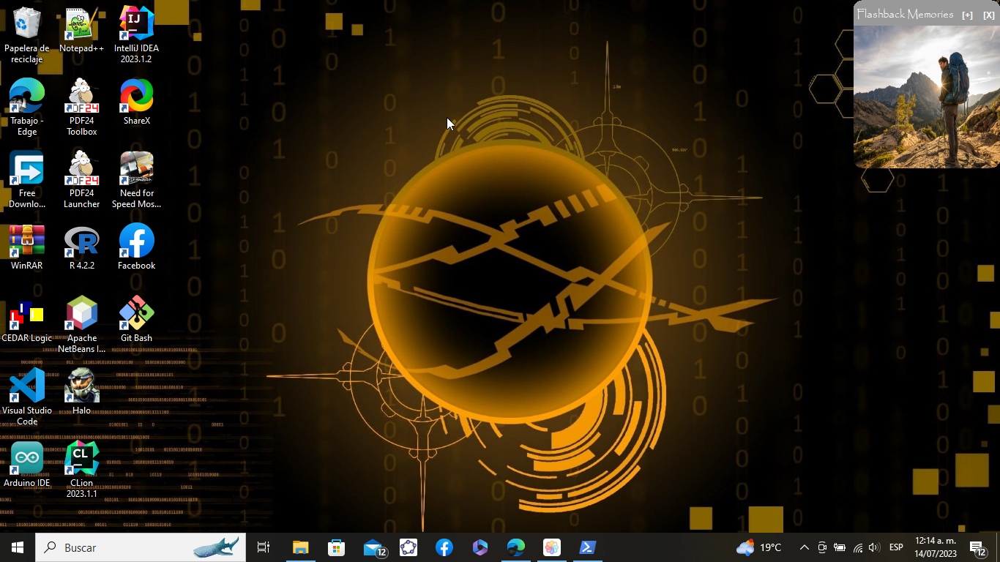

# FlashBack Widget

FlashBack Widget is an image gallery widget that allows you to enjoy your favorite photos on your desktop. This interactive widget allows you to easily browse through your images, change the widget color, and perform additional actions from the system tray.

  
  
  

## Features

- **Image Directory**: FlashBack Widget uses the C:/Imagenes folder as its default directory for images. You can add more images by opening the image directory from the widget itself.
- **System Tray Interaction (Notification Area)**: You can access widget options and change its settings by right-clicking on the widget title in the system tray.
- **Image Navigation**: Right-click on an image to advance to the next image in the gallery. Left-click to go back to the previous image.
- **Compatibility**: FlashBack Widget is compatible with Windows 7, 8, 10, and 11 operating systems. JDK8 is required as the minimum version.

## Execution Instructions

If you want to just run the widget, follow the steps below:
1. Clone the project download or clone the project
2. Go to the "EXE" folder
3. Run "FlashBack Memories.exe"
4. If you want the widget to run when Windows starts, run the **initToStart.bat** script with administrator permissions

## Distribution

If you want to distribute this project, follow these steps:

1. Compile the project following the instructions above.
2. Once compiled, compress the "dist" folder (including the "lib" folder).
3. Distribute the resulting ZIP file.

**Note**: If two JAR files in the project's classpath have the same name, only the first JAR file is copied to the "lib" folder. Only JAR files are copied to the "lib" folder. If the classpath contains other types of files or folders, they will not be copied.

If a library on the project's classpath also has a Class-Path element specified in the manifest, the content of the Class-Path element must be on the project's runtime path.

To set a main class in a standard Java project, right-click the project node in the "Projects" window and choose "Properties". Then click "Run" and enter the class name in the "Main Class" field. Alternatively, you can manually type the class name in the manifest's "Main-Class" element.

Enjoy FlashBack Widget and relive your memories in style on your desktop!
