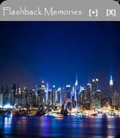

# FlashBack Widget

FlashBack Widget is an image gallery widget that allows you to enjoy your favorite photos on your desktop in the old windows 7 widget style. This interactive widget allows you to easily navigate through your images, change the widget color and perform actions extras from the system tray.

  
  
  

  

## Features

- **Image Directory**: FlashBack Widget uses the C:/Imagenes folder as its default directory for images. You can add more images by opening the image directory from the widget itself.
- **System Tray Interaction (Notification Area)**: You can access widget options and change its settings by right-clicking on the widget title in the system tray.
- **Image Navigation**: Right-click on an image to advance to the next image in the gallery. Left-click to go back to the previous image.
- **Widget Navigation**: FlashBack Widget can be dragged around the entire window, left click on the title and drag across the desktop to arrange it to your liking. Double click on the title and the widget will return to its original position.
- **Compatibility**: FlashBack Widget is compatible with Windows 7, 8, 10, and 11 operating systems. JDK8 is required as the minimum version.

## Execution Instructions

If you want to just run the widget, follow the steps below:
1. Clone the project download or clone the project
2. Go to the "EXE" folder
3. Run "FlashBack Memories.exe"
4. If you want the widget to run when Windows starts, run the **initToStart.bat** script with administrator permissions

## Additional

Inside the EXE folder you will also find the JAR file.
You can use the "--developer" and "--version" arguments to display additional notes.

  

**Note**: In case the directory is not found, the program will create the "Images" directory on the Local C drive. Make sure you have memorable images available.
